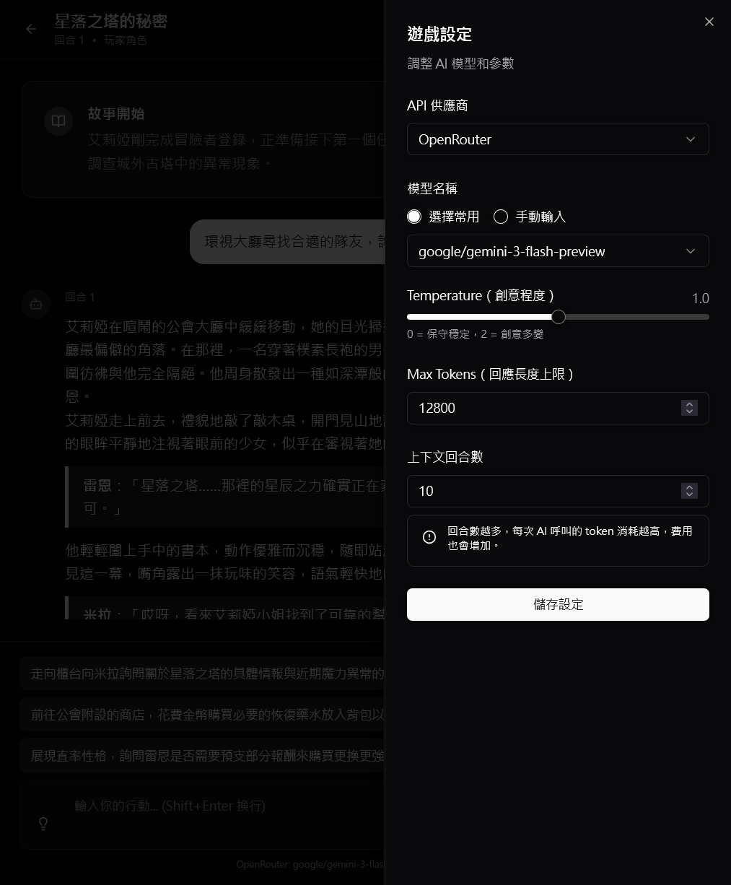
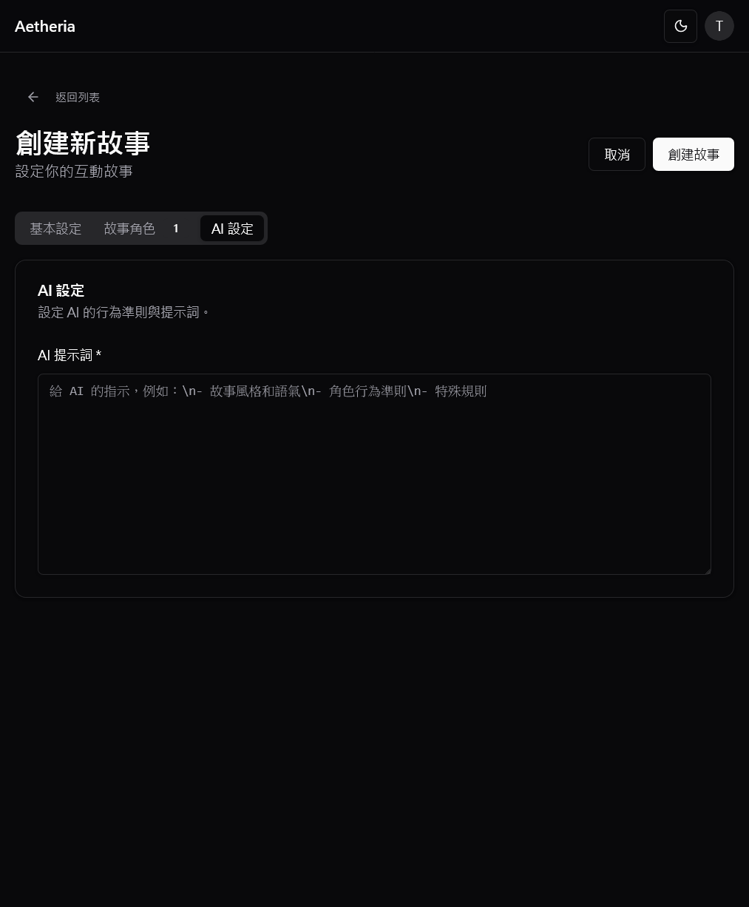

# Aetheria - AI 互動小說創作平台

> **打造屬於你的世界，與 AI 共創獨特的互動故事體驗**

[線上體驗 Live Demo](https://aetheria-charliizs-projects.vercel.app/) • [功能介紹](#主要功能)

---

## 專案簡介

**Aetheria** 是一款結合現代 AI 技術的互動式小說遊戲平台。不同於傳統文字遊戲，Aetheria 讓玩家能夠完全自定義世界規則、狀態系統與角色設定，並透過 AI 驅動的敘事引擎，體驗每一次都獨一無二的冒險旅程。

### 核心特色

- **高度客製化**：定義你的世界規則、屬性系統（HP/MP/SAN值等）與物品機制。
- **深度角色扮演**：創造擁有獨特背景、性格與說話風格的 AI 角色。
- **智慧敘事引擎**：整合 OpenRouter 與 OpenAI，提供流暢、連貫且富有深度的故事體驗。
- **現代化介面**：精心設計的響應式 UI，支援深色模式與行動裝置體驗。

---

## 遊戲畫面展示

### 核心體驗

  
  
  

### 創作工具

  
  
  

查看更多功能截圖

 

**世界觀管理**

  
  

**角色與故事**

  
  

**故事與建議系統**

  
  

---

## 主要功能

### 沉浸式遊玩
- **聊天式敘事介面**：類似通訊軟體的流暢體驗。
- **動態狀態追蹤**：AI 自動判定故事對角色的影響（受傷、獲得物品、升級）。
- **滾動摘要系統**：自動摘要長篇劇情，讓 AI 保持長期記憶。
- **多種遊戲模式**：支援單一角色扮演 (PC Mode) 與全知導演模式 (Director Mode)。

### 強大的創作系統
- **自定義 Schema**：不只是寫設定，更能定義數值系統（Number, Boolean, Enum, List）。
- **角色卡系統**：跨世界共用的角色模板，設定一次，到處遊玩。
- **AI 生成助手**：一鍵生成完整世界觀（含狀態系統）或角色設定，大幅加速創作流程。

### 進階技術整合
- **雙 AI 供應商**：支援 **OpenRouter** (Claude, Llama, Mistral) 與 **OpenAI** (GPT-4)。
- **即時串流**：文字逐字生成，減少等待焦慮。
- **Markdown 渲染**：支援豐富的文字格式與對話樣式。

---

## 技術架構

本專案採用現代化的 T3 Stack 變體架構，強調效能、型別安全與開發體驗。

| 層級 | 技術棧 |
|------|--------|
| **Frontend** | Next.js 15 (App Router), React 19, TypeScript |
| **Styling** | Tailwind CSS 3.4, Radix UI, Lucide Icons |
| **Backend** | Supabase (PostgreSQL, Auth, RLS) |
| **State** | React Context, SWR |
| **AI Integration** | OpenRouter API, OpenAI API |
| **Deployment** | Vercel |

---
