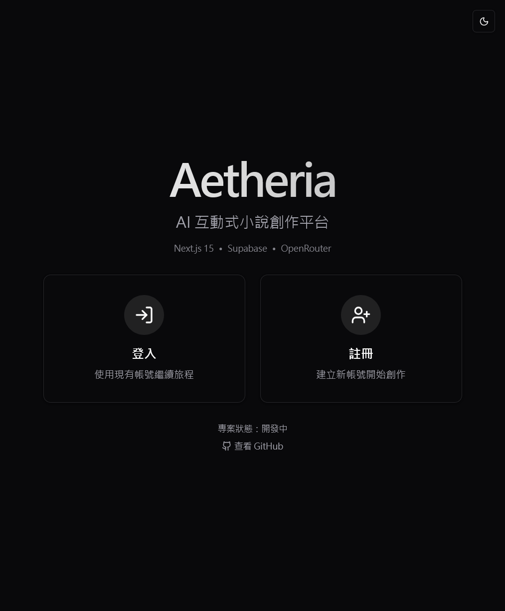
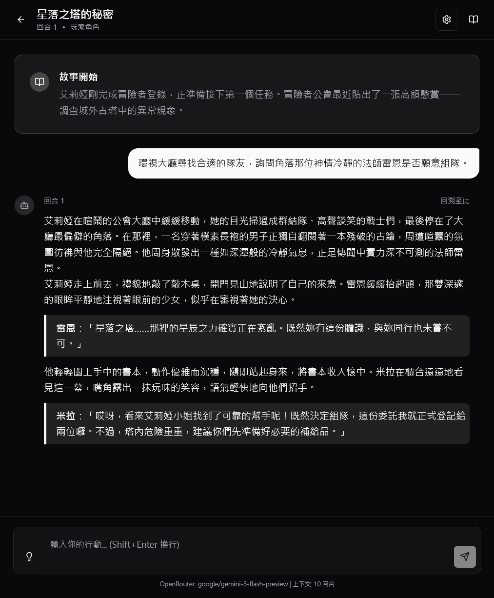
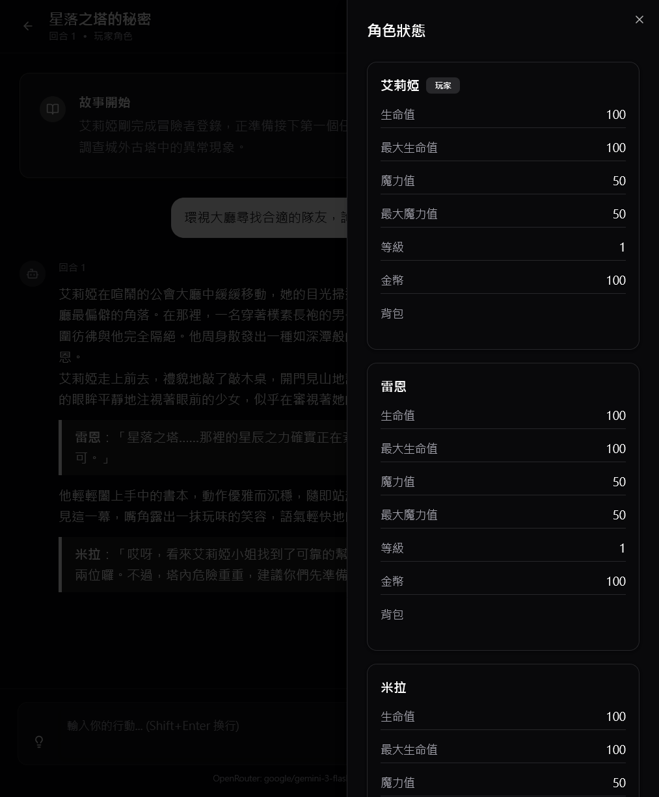
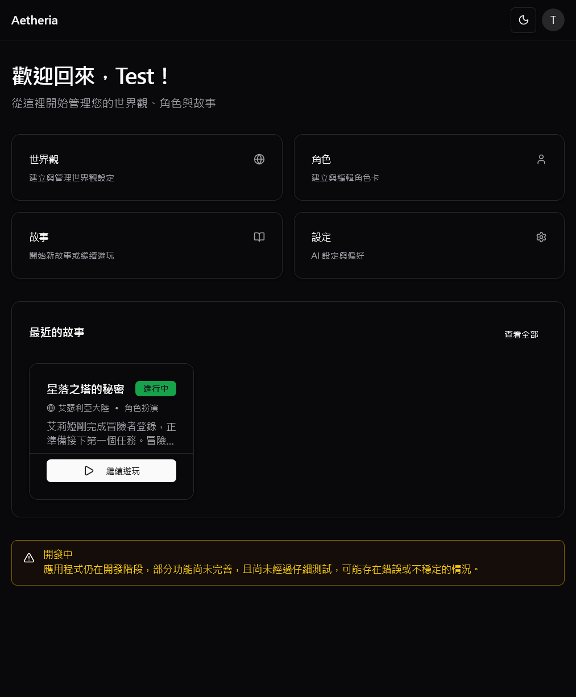
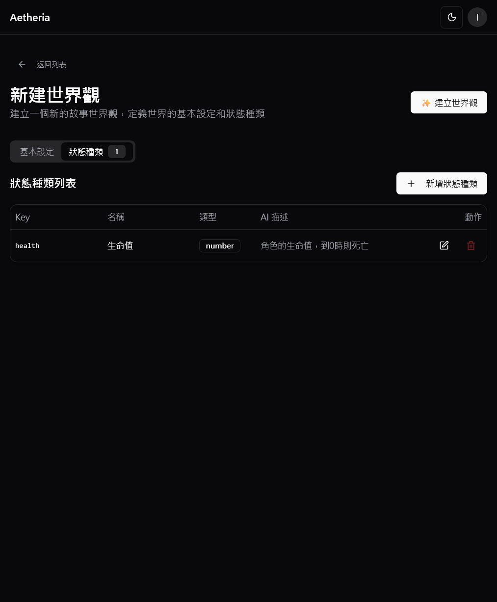
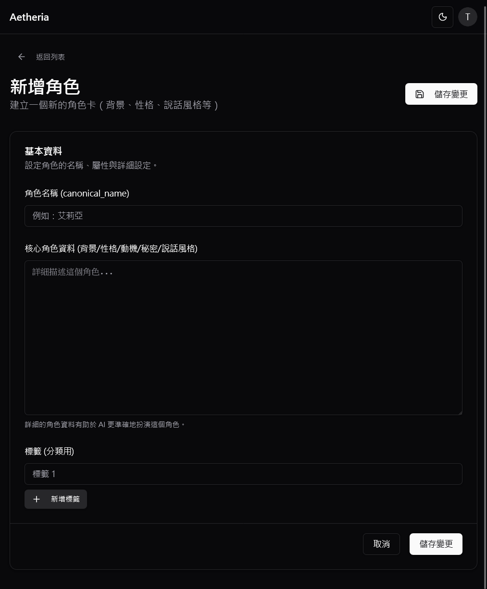
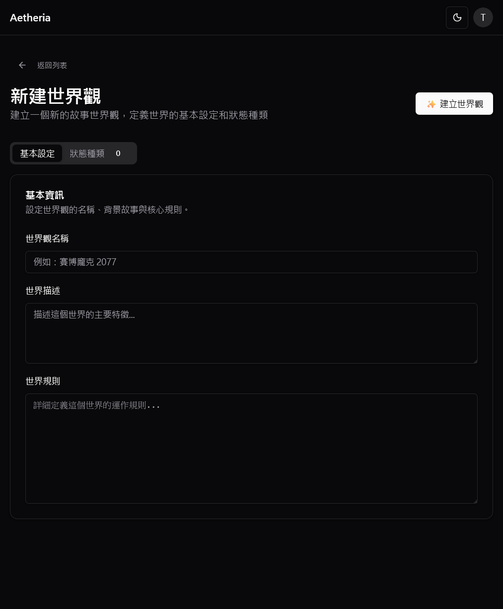
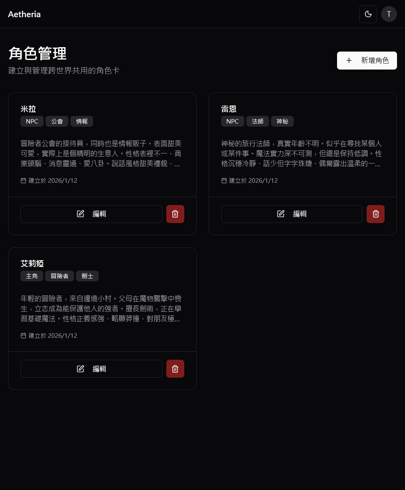
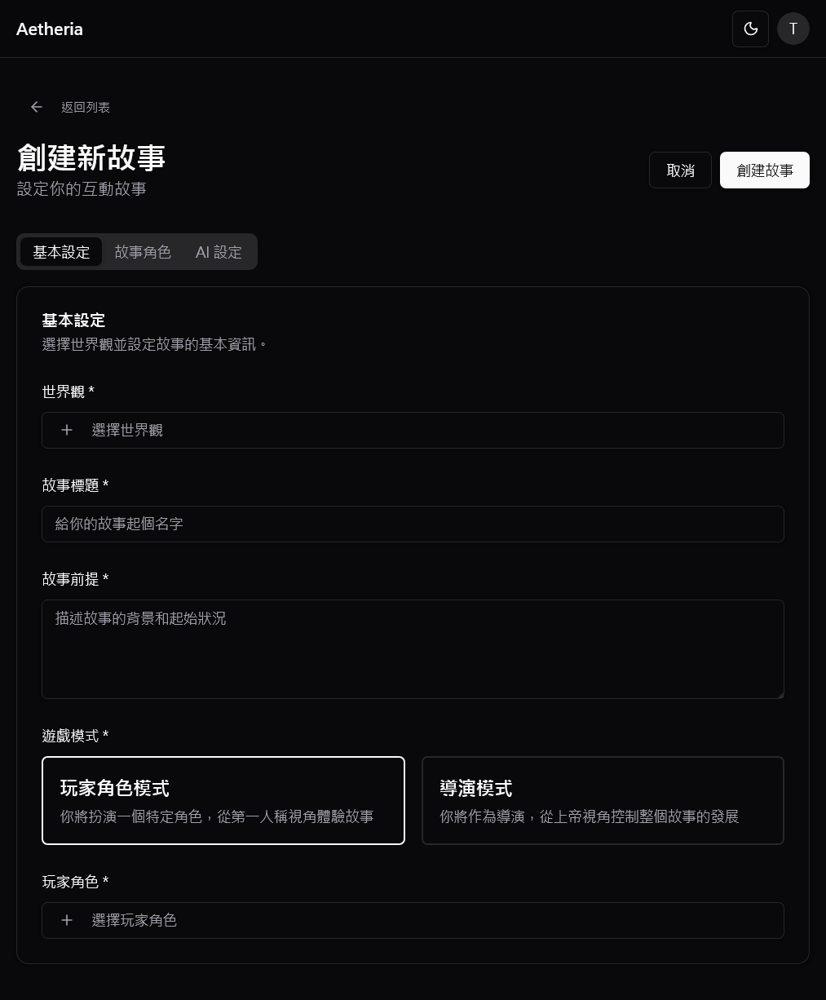
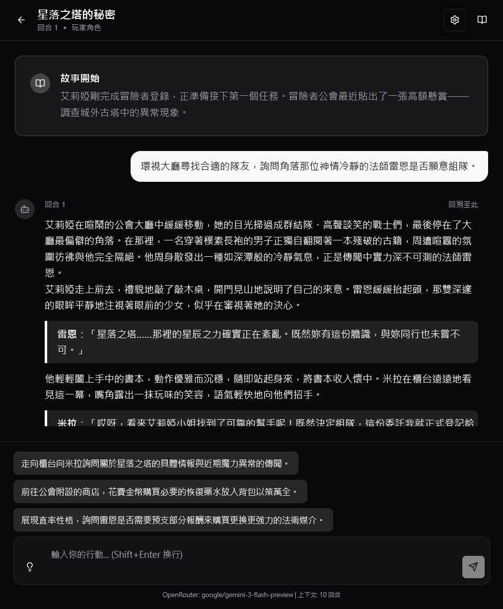

# Aetheria - AI 互動小說創作平台

<div align="center">



> **打造屬於你的世界，與 AI 共創獨特的互動故事體驗**

[](https://nextjs.org/)
[](https://supabase.com/)
[](https://tailwindcss.com/)
[](https://www.typescriptlang.org/)
[](https://vercel.com/)

[線上體驗 Live Demo](https://aetheria-charliizs-projects.vercel.app/) • [功能介紹](#主要功能)

</div>

---

## 專案簡介

**Aetheria** 是一款結合現代 AI 技術的互動式小說遊戲平台。不同於傳統文字遊戲，Aetheria 讓玩家能夠完全自定義世界規則、狀態系統與角色設定，並透過 AI 驅動的敘事引擎，體驗每一次都獨一無二的冒險旅程。

### 核心特色

- **🌍 高度客製化**：定義你的世界規則、屬性系統（HP/MP/SAN值等）與物品機制。
- **👥 深度角色扮演**：創造擁有獨特背景、性格與說話風格的 AI 角色。
- **🤖 智慧敘事引擎**：整合 OpenRouter 與 OpenAI，提供流暢、連貫且富有深度的故事體驗。
- **🎨 現代化介面**：精心設計的響應式 UI，支援深色模式與行動裝置體驗。
- **🌐 社群分享**：公開你的世界觀與角色，讓其他玩家 Fork 並創作自己的故事。
- **🔄 版本同步**：追蹤 Fork 來源的更新，隨時同步最新內容或保留自己的改動。
- **🖼️ 圖片上傳**：為世界觀、角色和個人頭像上傳自訂圖片，提升視覺體驗。

---

## 遊戲畫面展示

### 核心體驗
<div align="center">
  
  
  
</div>

### 社群與分享
<div align="center">
  
  
  
</div>

### 創作工具
<div align="center">
  
  
  
</div>

<details>
<summary>查看更多功能截圖</summary>
<br>

**世界觀管理**
<div align="center">
  
  
</div>

**角色與故事**
<div align="center">
  
  
</div>

**圖片上傳與個性化**
<div align="center">
  
  
</div>

**故事進階功能**
<div align="center">
  
  
</div>

</details>

---

## 主要功能

### 🎮 沉浸式遊玩體驗
- **聊天式敘事介面**：類似通訊軟體的流暢體驗。
- **動態狀態追蹤**：AI 自動判定故事對角色的影響（受傷、獲得物品、升級）。
- **滾動摘要系統**：自動摘要長篇劇情，讓 AI 保持長期記憶。
- **多種遊戲模式**：支援單一角色扮演 (PC Mode) 與全知導演模式 (Director Mode)。
- **回合重生成**：不滿意 AI 的回應？重新生成獲得不同的結果。
- **故事重置**：隨時重新開始，保留設定但清空進度。

### 🛠️ 強大的創作系統
- **自定義 Schema**：不只是寫設定，更能定義數值系統（Number, Boolean, Enum, List）。
- **角色卡系統**：跨世界共用的角色模板，設定一次，到處遊玩。
- **AI 生成助手**：一鍵生成完整世界觀（含狀態系統）、角色設定或完整故事。
- **圖片上傳**：為世界觀、角色上傳自訂圖片（自動轉換為 WebP 格式）。
- **標籤系統**：為內容打標籤，方便分類與篩選。

### 🌐 社群與分享功能
- **公開發布**：將你的世界觀或角色設為公開，讓其他玩家欣賞。
- **Fork 機制**：複製他人的公開內容到自己的收藏，並進行客製化修改。
- **版本追蹤**：Fork 的內容會追蹤原始版本，當原作者更新時收到通知。
- **版本同步**：
  - 查看原始版本與你的版本之間的差異對比。
  - 選擇同步（覆蓋本地修改）或跳過（保留自己的版本）。
- **原作者標註**：Fork 的內容會顯示原作者資訊，尊重創作者。

### 📊 智慧更新系統
- **依賴追蹤**：系統自動追蹤故事使用的世界觀、角色、狀態定義。
- **更新提示**：當你修改世界觀或角色時，使用該資源的故事會收到更新提示。
- **版本控制**：每個 Fork 都有獨立的版本時間線，不會互相干擾。

### 🤖 進階 AI 技術整合
- **雙 AI 供應商**：支援 **OpenRouter** (Claude, Llama, Mistral) 與 **OpenAI** (GPT-4)。
- **即時串流**：文字逐字生成，減少等待焦慮。
- **Markdown 渲染**：支援豐富的文字格式與對話樣式。
- **上下文管理**：可設定 AI 記憶的回合數，平衡記憶長度與成本。

---

## 技術架構

本專案採用現代化的 T3 Stack 變體架構，強調效能、型別安全與開發體驗。

| 層級 | 技術棧 |
|------|--------|
| **Frontend** | Next.js 15 (App Router), React 19, TypeScript 5.0 |
| **Styling** | Tailwind CSS 3.4, Shadcn/ui, Radix UI, Lucide Icons |
| **Backend** | Supabase (PostgreSQL, Auth, RLS, Storage) |
| **State** | React Context, Zustand |
| **AI Integration** | OpenRouter API, OpenAI API (支援串流) |
| **Image Processing** | WebP 格式轉換, Supabase Storage |
| **Deployment** | Vercel |

### 資料庫設計亮點
- **Row Level Security (RLS)**：所有資料表都有完善的權限控制。
- **公開內容 RLS**：專門的政策允許跨使用者查詢公開內容。
- **Fork 追蹤系統**：`original_author_id`、`forked_from_id`、`last_synced_at` 實現版本管理。
- **標籤系統**：使用 junction tables（`world_tags`、`character_tags`、`story_tags`）+ 中央 `tags` 表。
- **圖片儲存**：URL 存於資料庫，實際檔案存於 Supabase Storage（WebP 格式）。

### AI 架構
專門的 AI Agent 系統處理不同任務：
- **Story Agent**：主要敘事生成 + 狀態變更判定
- **Summary Agent**：滾動摘要生成
- **Suggestion Agent**：行動建議生成
- **Generation Agent**：一鍵生成世界觀/角色/完整故事

---

## 快速開始

### 環境需求
- Node.js 18+
- npm 或 pnpm
- Supabase 專案（免費方案即可）
- OpenRouter 或 OpenAI API 金鑰

### 安裝步驟

1. **Clone 專案**
```bash
git clone https://github.com/your-username/aetheria.git
cd aetheria
```

2. **安裝相依套件**
```bash
npm install
# 或
pnpm install
```

3. **設定環境變數**

複製 `.env.example` 為 `.env.local`：
```bash
cp .env.example .env.local
```

填入以下資訊：
```env
NEXT_PUBLIC_SUPABASE_URL=your_supabase_url
NEXT_PUBLIC_SUPABASE_ANON_KEY=your_supabase_anon_key
SUPABASE_SERVICE_ROLE_KEY=your_service_role_key
```

4. **設定 Supabase 資料庫**

依序執行 `supabase/migrations/` 中的遷移檔案（001 到 019）。

5. **啟動開發伺服器**
```bash
npm run dev
```

訪問 [http://localhost:3000](http://localhost:3000) 開始使用！

### 設定 AI 服務

首次使用需要在設定頁面 (`/settings`) 配置：
1. 選擇 AI 供應商（OpenRouter 或 OpenAI）
2. 輸入 API 金鑰
3. 選擇預設模型
4. 調整 AI 參數（temperature, max_tokens 等）

---

## 專案結構

```
aetheria/
├── app/                    # Next.js App Router 頁面
│   ├── community/          # 社群瀏覽頁面
│   ├── stories/            # 故事相關頁面
│   ├── worlds/             # 世界觀管理
│   └── characters/         # 角色管理
├── components/             # React 元件
│   ├── ui/                 # Shadcn/ui 元件
│   └── auth/               # 認證元件
├── services/               # 業務邏輯層
│   ├── agents/             # AI Agents
│   ├── ai/                 # AI 供應商整合
│   ├── gameplay/           # 遊戲邏輯
│   └── supabase/           # 資料庫 CRUD
├── types/                  # TypeScript 型別定義
├── lib/                    # 工具函式
├── supabase/migrations/    # 資料庫遷移檔
└── public/screenshots/     # 專案截圖
```

---

## 開發指南

詳細的開發文件請參考：
- **[CLAUDE.md](./CLAUDE.md)** - 完整的專案架構與功能說明（適合 Claude Code AI）
- **[AGENTS.md](./AGENTS.md)** - 開發規範與最佳實踐（適合 AI Coding Agents）

### 主要開發命令
```bash
npm run dev        # 啟動開發伺服器
npm run build      # 建置正式版本
npm run start      # 啟動正式伺服器
npm run lint       # 執行 ESLint
npm run tauri      # Tauri 桌面版指令
```

---

## 貢獻指南

歡迎提交 Issue 或 Pull Request！在提交 PR 前請確保：
1. 程式碼通過 ESLint 檢查
2. 遵循現有的程式碼風格
3. 更新相關文件（CLAUDE.md、AGENTS.md）
4. 提供清晰的 commit 訊息

---

## 授權條款

本專案採用 MIT 授權條款 - 詳見 [LICENSE](LICENSE) 檔案。

---

## 致謝

- [Next.js](https://nextjs.org/) - 強大的 React 框架
- [Supabase](https://supabase.com/) - 開源的 Firebase 替代方案
- [Shadcn/ui](https://ui.shadcn.com/) - 精美的 UI 元件庫
- [OpenRouter](https://openrouter.ai/) - 多模型 AI API 聚合服務
- [Vercel](https://vercel.com/) - 優秀的部署平台

---

<div align="center">

**用 AI 創造無限可能的故事世界 ✨**

[回到頂部](#aetheria---ai-互動小說創作平台)

</div>
