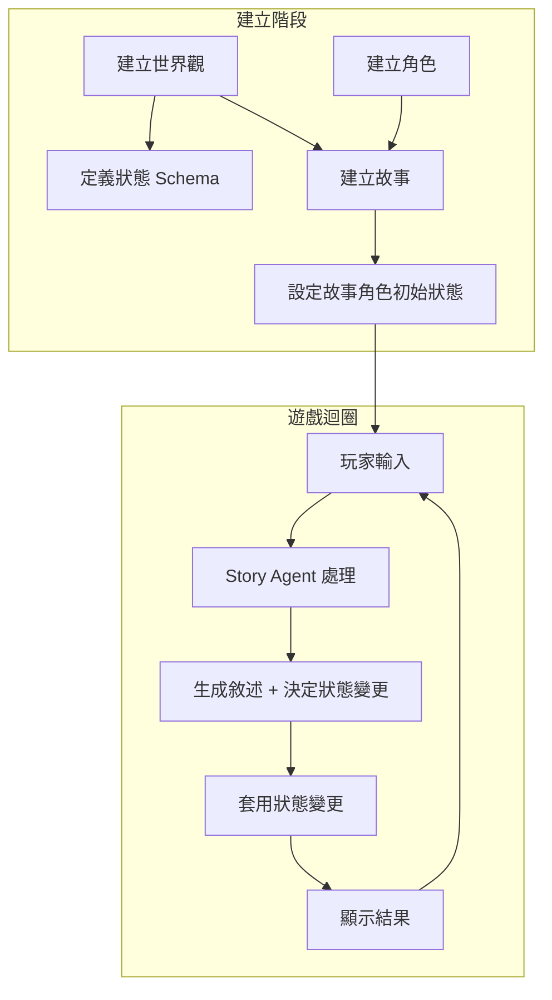

# Aetheria - AI 互動小說應用程式

## 📋 專案概覽

Aetheria 是一款基於 AI 的互動式小說遊戲平台，讓玩家能夠：
- 建立世界觀與狀態系統
- 建立可重用的角色
- 創造獨特的故事並與 AI 互動
- 即時追蹤角色狀態和物品

> **🔑 測試帳號**：`test@gmail.com` / `test1234`

---

## 🏗️ 技術棧

### 前端
| 類別 | 技術 |
|------|------|
| 框架 | Next.js 15 (App Router) |
| 語言 | TypeScript |
| 樣式 | Tailwind CSS 3.4 |
| UI 組件 | Radix UI |
| 圖示 | Lucide React |
| 通知 | Sonner (Toast) |
| 主題 | next-themes (深色/淺色) |
| 表單 | React Hook Form + Zod |
| 工具 | clsx + tailwind-merge |

### 後端
| 類別 | 技術 |
|------|------|
| 資料庫 | Supabase (PostgreSQL) |
| 認證 | Supabase Auth |
| 安全性 | Row Level Security (RLS) |

### AI 服務
| 類別 | 說明 |
|------|------|
| 供應商 | OpenRouter / OpenAI |
| 預設模型 | Claude 3.5 Sonnet (OpenRouter) / GPT-4o (OpenAI) |

---

## 🎯 核心概念

| 名詞 | 定義 |
|------|------|
| **World** | 世界規則 + 狀態 Schema 定義 |
| **WorldStateSchema** | 定義角色可擁有的狀態欄位（HP、MP、物品等） |
| **Character** | 跨世界共用的角色卡（背景、性格、說話風格） |
| **Story** | 一次遊玩實例，綁定 1 個世界觀 + 多個角色 |
| **StoryCharacter** | 角色在特定故事中的實例 |
| **Turn** | 玩家輸入 → AI 生成敘述 → 狀態變更的最小單位 |

### 遊戲模式
- **PLAYER_CHARACTER 模式**：玩家控制一個特定角色
- **DIRECTOR 模式**：玩家是導演，可指揮所有角色和事件

---

## 🎮 遊戲流程



### Story Agent（合併版 v0.9.2）

單次 API 呼叫同時處理敘事生成和狀態變更：

```json
{
  "narrative": "敘述文字（對話使用 > **角色名**：「對話」格式）",
  "state_changes": [
    {"target_story_character_id": "xxx", "schema_key": "hp", "op": "set|inc", "value": 10, "reason": "原因"}
  ],
  "list_ops": [
    {"target_story_character_id": "xxx", "schema_key": "inventory", "op": "push|remove|set", "value": "物品", "reason": "原因"}
  ]
}
```

---

## 📁 專案結構

```
Aetheria/
├── app/                    # Next.js App Router
│   ├── page.tsx           # 首頁
│   ├── login/             # 登入頁
│   ├── register/          # 註冊頁
│   ├── dashboard/         # 儀表板
│   ├── worlds/            # 世界觀管理
│   ├── characters/        # 角色管理
│   ├── stories/           # 故事管理與遊玩
│   │   └── generate/      # AI 快速生成故事頁面
│   └── settings/          # 設定頁（AI 供應商、帳戶）
├── components/
│   ├── ui/                # Radix UI 組件
│   ├── auth/              # 認證相關組件
│   ├── layout/            # 布局組件
│   ├── ai-generation-dialog.tsx  # AI 生成對話框（世界觀/角色）
│   └── tag-selector.tsx          # 標籤選擇器組件
├── contexts/              # React Context (AuthContext)
├── lib/
│   ├── ai-providers.ts    # AI 供應商設定
│   ├── supabase/          # Supabase 客戶端
│   └── theme/             # 主題設定
├── services/
│   ├── agents/            # AI Agent (story-agent, generation-agent)
│   ├── ai/                # AI API 封裝 (openrouter.ts)
│   ├── gameplay/          # 遊戲邏輯 (execute-turn.ts)
│   └── supabase/          # 資料庫服務 (11 個檔案)
└── types/                 # TypeScript 類型定義
```

---

## ✅ 功能完成狀態

### 核心功能 [100%]

- [x] **使用者系統**：註冊、登入、登出、認證保護
- [x] **世界觀管理**：CRUD、複製、狀態 Schema 定義
- [x] **角色管理**：CRUD、標籤、複製、統一格式範本
- [x] **故事系統**：建立、編輯、角色初始狀態設定
- [x] **遊戲核心迴圈**：Story Agent、狀態追蹤、即時更新
- [x] **AI 整合**：OpenRouter/OpenAI、模型選擇、參數調整
- [x] **AI 生成助手**：一鍵生成世界觀、角色設定（含 Schema）
- [x] **AI 快速開始**：完整故事生成頁面（/stories/generate），支援編輯與 AI 對話修改
- [x] **UI 系統**：深色/淺色主題、響應式設計、Toast 通知

### 遊戲頁面功能

- [x] 聊天式敘事介面
- [x] Markdown 對話格式（`> **角色名**：「對話」`）
- [x] 即時反饋（樂觀 UI、AI 思考動畫、錯誤處理）
- [x] 設定面板（供應商、模型、Temperature、Max Tokens、上下文回合數）
- [x] 狀態面板（即時顯示所有角色狀態）
- [x] 滾動摘要功能（自動摘要過去劇情，支援回溯）

### 技術優化

- [x] 資料庫重試機制（智能逾時、指數退避）
- [x] useEffect 防競爭條件模式
- [x] Supabase onAuthStateChange 最佳實踐
- [x] 並行資料載入

---

## 🟡 待完成功能

| 功能 | 說明 | 優先級 |
|------|------|--------|
| ~~Action Suggestion~~ | ~~生成行動建議按鈕~~ | ~~中~~ ✅ |
| ChangeLog 系統 | 記錄每次狀態變更歷史 | 低 |
| 回顧頁面 | 查看回合詳情和狀態 diff | 低 |
| 分支/回溯 | 回到特定回合重玩 | 低 |

---

## 📊 整體完成度

```
核心功能    ████████████████████ 100%
進階功能    ░░░░░░░░░░░░░░░░░░░░   0%
─────────────────────────────────────
總體        ████████████████░░░░  85%
```

---

## 📝 重要開發模式

### useEffect 防競爭條件

```tsx
useEffect(() => {
  let cancelled = false;

  const fetchData = async () => {
    if (!user?.user_id) {
      setLoading(false);
      return;
    }
    
    try {
      setLoading(true);
      const data = await getData(user.user_id);
      if (cancelled) return;
      setData(data);
    } finally {
      if (!cancelled) setLoading(false);
    }
  };

  fetchData();
  return () => { cancelled = true; };
}, [user?.user_id]);
```

### Supabase onAuthStateChange

```tsx
// ❌ 不要使用 async/await，會導致死鎖
// ✅ 使用 setTimeout 延遲執行
supabase.auth.onAuthStateChange((event, session) => {
  if (event === 'SIGNED_IN' || event === 'TOKEN_REFRESHED') {
    setTimeout(() => refreshUser(), 0);
  }
});
```

---

**最後更新**：2026-01-14  
**當前版本**：v0.9.5-alpha  
**專案狀態**：核心功能完成（AI 快速生成頁面、AI 生成助手、合併版 Story Agent、Markdown 對話、雙 AI 供應商）